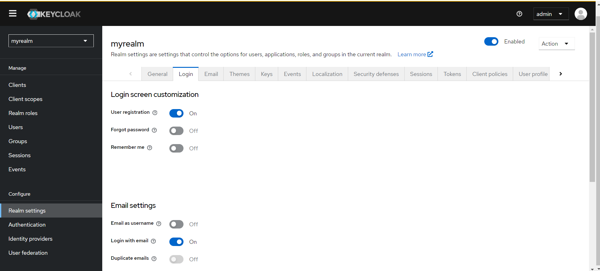

# Een andere kijk op inloggen: Keycloak voor DevOps

*[Jorian Roelofsen, oktober 2024.](https://github.com/hanaim-devops/devops-blog-JorianRoelofsen)*
<hr/>

Inloggen is altijd een hoop extra moeite in een project, vooral als je het werkend moet houden in in een microservices-architectuur. Keycloak is een open-source identity en access management tool die dit proces een stuk versimpeld. In deze blog ga ik in op de voordelen van Keycloak en hoe je het kan integreren in een moderne IT-infrastructuur.

## Wat is Keycloak?

Keycloak is een open-source identity and access management (IAM) tool, ontworpen om gebruikersbeheer en authenticatie te vereenvoudigen. Het biedt een centrale plek waar je toegang tot applicaties kunt beheren, zonder dat elke applicatie apart gebruikersbeheer en authenticatie hoeft te implementeren.

Je kan gebruikers laten inloggen met verschillende identiteitsproviders, zoals sociale netwerken (Google, Facebook), LDAP-servers of standaard login-systemen. Het ondersteunt ook Single Sign-On (SSO), wat betekent dat gebruikers maar één keer hoeven in te loggen om toegang te krijgen tot meerdere applicaties.

Keycloak is goed geïntegreerd in het cloud-native ecosysteem. Het draait op Kubernetes en kan worden geïnstalleerd met Operators die zijn gebouwd met het Operator Framework(https://www.cncf.io/projects/operator-framework/). Daarnaast biedt het metrics aan voor Prometheus en het integreert goed met een standaard Kubernetes-stack.

## Keycloak voor en nadelen

### Voordelen van Keycloak

#### 1. Single Sign-On (SSO)

Een van de grootste voordelen van Keycloak is de SSO-functionaliteit, waarmee gebruikers slechts één keer hoeven in te loggen om toegang te krijgen tot meerdere applicaties. Dit verbetert de gebruikerservaring aanzienlijk en verhoogt de beveiliging door het beperken van meerdere aanmeldpogingen(https://www.intension.de/en/infoblog/keycloak-advantages-disadvantages/)(https://pretius.com/blog/keycloak-sso/). Vooral in omgevingen met meerdere services, zoals microservices of bedrijfsapplicaties, kan SSO een grote efficiëntieslag betekenen.

#### 2. Standaardondersteuning voor SAML 2.0 en OpenID Connect

Keycloak ondersteunt de meest gebruikte protocollen voor authenticatie, zoals **SAML 2.0** en **OpenID Connect (OIDC)**. Dit maakt de integratie met bestaande systemen en applicaties eenvoudiger en zorgt ervoor dat Keycloak breed inzetbaar is binnen verschillende IT-omgevingen(https://www.intension.de/en/infoblog/keycloak-advantages-disadvantages/).

#### 3. Gebruikersfederatie en Identiteitsbemiddeling

Een ander sterk punt van Keycloak is de mogelijkheid om gebruikersgegevens te integreren vanuit externe bronnen zoals **LDAP** of **Active Directory**(https://www.intension.de/en/infoblog/keycloak-strengths/). Daarnaast kunnen gebruikers inloggen met inloggegevens van derde partijen, zoals Google of Facebook, wat de flexibiliteit en gebruiksvriendelijkheid vergroot.

#### 4. Twee-factor Authenticatie (2FA)

Veiligheid staat centraal in Keycloak, en de tool biedt ondersteuning voor **twee-factor authenticatie (2FA)**, wat extra beveiligingslagen toevoegt door bijvoorbeeld de integratie van Google Authenticator(https://www.intension.de/en/infoblog/keycloak-advantages-disadvantages/). Dit is vooral belangrijk in omgevingen waar gevoelige informatie wordt beheerd.

#### 5. Open Source en Community-gedreven

Keycloak is een open-source project, wat betekent dat het actief wordt onderhouden en uitgebreid door een grote gemeenschap. Dit zorgt voor continue verbetering en een breed scala aan integratiemogelijkheden, zonder de kosten van een commerciële licentie(https://www.intension.de/en/infoblog/keycloak-strengths/).

### Nadelen van Keycloak

#### 1. Single Point of Failure

Hoewel Keycloak krachtige beveiliging biedt, kan het een enkel storingspunt worden binnen de infrastructuur als het niet goed wordt geconfigureerd. Een storing in Keycloak kan ervoor zorgen dat gebruikers geen toegang meer hebben tot essentiële applicaties, wat voor organisaties met strikte uptime-eisen een groot risico kan vormen(https://www.intension.de/en/infoblog/problems-with-keycloak/).

#### 2. Complexiteit in Beheer

Het beheren en configureren van Keycloak kan complex zijn, vooral voor grotere organisaties met geavanceerde behoeften(https://www.intension.de/en/infoblog/keycloak-advantages-disadvantages/). Het vereist ervaring en deskundigheid om Keycloak correct te implementeren, high availability (HA) te waarborgen en de juiste schaalbaarheid te garanderen(https://www.reddit.com/r/devops/comments/1ak7pex/is_keycloak_worth_the_maintenance/). Dit kan leiden tot een steilere leercurve voor teams zonder ervaring met IAM-oplossingen.

#### 3. Onderhoud en Updates

Keycloak is een zelf-gehoste oplossing, wat betekent dat teams verantwoordelijk zijn voor het up-to-date houden van de software, het toepassen van beveiligingspatches en het uitvoeren van prestatiemonitoring(https://www.intension.de/en/infoblog/keycloak-advantages-disadvantages/). Dit kan de onderhoudslast vergroten in vergelijking met volledig beheerde diensten, zoals commerciële IAM-oplossingen.

## Keycloak vs de concurrentie

Bij het kiezen van een Identity en Access Management (IAM) oplossing is het essentieel om verschillende opties te overwegen. Naast Keycloak zijn er namelijk tal van alternatieven beschikbaar die elk unieke voordelen en beperkingen hebben. Laten we enkele veelgebruikte alternatieven bekijken en deze vergelijken met Keycloak op basis van functies, schaalbaarheid, en beheer.

### FreeIPA en OpenLDAP

FreeIPA en OpenLDAP zijn populaire open-source oplossingen voor identiteitsbeheer, maar ze verschillen aanzienlijk van Keycloak. FreeIPA biedt een alles-in-één oplossing voor Identity, Policy en Audit, en is vooral sterk in Unix-achtige omgevingen. Het biedt robuuste integraties voor LDAP en Kerberos, maar mist de ingebouwde ondersteuning voor moderne protocollen zoals OpenID Connect en SAML, die cruciaal zijn in cloud-native omgevingen.(https://www.reddit.com/r/linuxadmin/comments/gdegxl/keycloak_freeipa_openldap_proscons/)(https://permify.co/post/top-open-source-keycloak-alternatives/#top-7-open-source-keycloak-alternatives)

OpenLDAP is een pure LDAP-directorydienst, wat het ideaal maakt voor gebruik in organisaties met zware eisen op het gebied van gegevensbeheer. Echter, het is beperkt in zijn ondersteuning van moderne authenticatieprotocollen en heeft geen standaard Single Sign-On (SSO)-functionaliteit, wat Keycloak wel biedt.(https://www.reddit.com/r/linuxadmin/comments/gdegxl/keycloak_freeipa_openldap_proscons/)

### FusionAuth

FusionAuth is een andere veelgebruikte concurrent van Keycloak en richt zich op ontwikkelaars die een eenvoudig te implementeren oplossing willen zonder complexe configuraties. FusionAuth biedt uitgebreide ondersteuning voor SAML, OAuth2, en OpenID Connect, net als Keycloak. Het grote verschil is echter dat FusionAuth gebruiksvriendelijker is voor teams zonder veel IAM-ervaring, terwijl Keycloak meer configuratie-opties biedt voor gevorderde gebruikers.(https://fusionauth.io/guides/keycloak-alternatives#fusionauth)

### Auth0

Auth0 is een commercieel alternatief voor Keycloak en biedt een beheerde IAM-oplossing, wat betekent dat je je geen zorgen hoeft te maken over hosting, onderhoud of updates. Auth0 staat bekend om zijn uitgebreide documentatie en gebruiksvriendelijke interfaces, maar heeft wel een prijskaartje, wat een drempel kan zijn voor kleinere teams of startups. Keycloak, als open-source optie, biedt een gratis oplossing die volledig in eigen beheer is.(https://www.zluri.com/blog/keycloak-alternatives/)

## Keycloak in een microfrontend-architectuur?

Voor deze vraag heb ik zelf een applicatie gebouwd met een microfrontend-architectuur en Keycloak geïntegreerd voor authenticatie en autorisatie. De applicatie bestaat uit drie microfrontends. Keycloak wordt gebruikt voor het inloggen en autoriseren van gebruikers. Bij het inloggen wordt een JWT-token gegenereerd en opgeslagen in de browser. Deze token wordt vervolgens gebruikt om de gebruiker te autoriseren voor toegang tot de ander microfrontends.

Om te beginnen heb ik een keycloak server en 3 react frontends opgezet en geconfigureerd. De keycloak server draait op `http://localhost:8080` en de frontends op `http://localhost:30081`, `http://localhost:30082` en `http://localhost:30083`. Voor het maken van de keycloak instance heb ik gebruik gemaakt van de informatie gegeven in de github repository van keycloak([TODO: bron](https://raw.githubusercontent.com/keycloak/keycloak-quickstarts/latest/kubernetes/keycloak.yaml)). Voor het maken van de react pods heb ik de volgende yaml files gebruikt:

```yaml
apiVersion: apps/v1
kind: Deployment
metadata:
  name: microfrontend-1
spec:
  replicas: 1
  selector:
    matchLabels:
      app: microfrontend-1
  template:
    metadata:
      labels:
        app: microfrontend-1
    spec:
      containers:
      - name: microfrontend-1
        image: <person>/<image-name>:<tag>  # Update with the correct image name
        imagePullPolicy: "Always"
        ports:
        - containerPort: 80

---
apiVersion: v1
kind: Service
metadata:
  name: microfrontend-1
spec:
  type: NodePort
  ports:
  - port: 80
    targetPort: 80
    nodePort: 30081  # Change as necessary
  selector:
    app: microfrontend-1
```

In de `microfrontend-2` en `microfrontend-3` yaml files heb ik de `microfrontend-1` vervangen met `microfrontend-2` en `microfrontend-3` en de nodePort aangepast naar `30082` en `30083` respectievelijk.

Vervolgens heb ik de keycloak server geconfigureerd met een realm, client, voor de volledige tutorial zie de volgende bron([TODO: bron](https://www.keycloak.org/getting-started/getting-started-kube)). Daarnaast heb ik ook nog een extra optie toegevoegd die er voor zorgt dat een gebruiker kan registreren. Dit heb ik gedaan door de `registration` optie aan te zetten in de realm settings.


De client is geconfigureerd met de redirect uri's van de frontends en de frontends zijn geconfigureerd met de client id en de keycloak server url. De frontends maken gebruik van de `keycloak-js` library om de gebruiker te authenticeren en autoriseren. Dit heb ik gedaan met de volgende code:

```javascript
import React from 'react';
import ReactDOM from 'react-dom/client';
import './index.css';
import App from './App';
import Keycloak from 'keycloak-js';

// Create a new instance of Keycloak using 'new'
const keycloak = new Keycloak({
    url: 'http://localhost:8080',
    realm: 'myrealm', //the realm you created
  clientId: 'myclient', //the client you created
});

const root = ReactDOM.createRoot(document.getElementById('root'));

keycloak.init({
  onLoad: 'login-required',
  silentCheckSsoRedirectUri: window.location.origin + '/silent-check-sso.html',
  pkceMethod: 'S256',
  redirectUri: window.location.origin,
}).then((authenticated) => {
    if (authenticated) {
        root.render(
            <React.StrictMode>
                <App />
            </React.StrictMode>
        );
    } else {
        window.location.reload();
    }
}).catch((error) => {
    console.error('Failed to initialize Keycloak:', error);
});
```

In deze code zie je een aantal belangerijke dingen, zoals de `url`, `realm` en `clientId` van de keycloak server. Deze moeten overeenkomen met de configuratie van de keycloak server. Daarnaast zie je dat de `keycloak.init` functie wordt aangeroepen met een aantal opties, zoals `onLoad`, `silentCheckSsoRedirectUri`, `pkceMethod` en `redirectUri`. Deze opties zijn nodig om de gebruiker te authenticeren en autoriseren. Als de gebruiker geauthenticeerd is wordt de `App` gerenderd, anders wordt de pagina opnieuw geladen.

## Conclusie

Keycloak kan zeer effectief worden ingezet voor gebruikersbeheer en authenticatie binnen een moderne IT-infrastructuur, vooral dankzij de uitgebreide ondersteuning voor Single Sign-On (SSO), moderne authenticatieprotocollen zoals OpenID Connect en SAML 2.0, en de integratiemogelijkheden met populaire identiteitsproviders en gebruikersfederaties zoals LDAP en Active Directory. Deze eigenschappen maken het bijzonder geschikt voor omgevingen met microservices, Kubernetes, en cloud-native applicaties.

Daarnaast biedt Keycloak extra beveiligingsopties zoals twee-factor authenticatie (2FA) en de mogelijkheid om gebruikersregistratie en -beheer centraal te regelen. Hoewel Keycloak zelf-hosting en onderhoud vereist, wat kan zorgen voor enige complexiteit, wegen de voordelen op het gebied van flexibiliteit, kostenbesparing (door het open-source karakter), en community-ondersteuning zwaar in moderne IT-omgevingen.

Kortom, Keycloak is een veelzijdige en krachtige IAM-oplossing die organisaties in staat stelt om veilige en schaalbare gebruikersauthenticatie te implementeren zonder afbreuk te doen aan flexibiliteit of gebruikerservaring.

## Bronnen

Cloud Native Computing Foundation. (2023, April 11). Keycloak joins CNCF as an incubating project. https://www.cncf.io/blog/2023/04/11/keycloak-joins-cncf-as-an-incubating-project/

FusionAuth. (n.d.). Keycloak alternatives. https://fusionauth.io/guides/keycloak-alternatives/

GitHub. (n.d.). Keycloak quickstarts repository. https://raw.githubusercontent.com/keycloak/keycloak-quickstarts/latest/kubernetes/keycloak.yaml

Intension. (n.d.). Keycloak - advantages and disadvantages. https://www.intension.de/en/infoblog/keycloak-advantages-disadvantages/

Keycloak. (n.d.). Getting started with Keycloak on Kubernetes. https://www.keycloak.org/getting-started/getting-started-kube

Permify. (n.d.). Top open-source Keycloak alternatives. https://permify.co/post/top-open-source-keycloak-alternatives/

Pretius. (n.d.). Keycloak SSO implementation. https://pretius.com/blog/keycloak-sso/

Reddit. (n.d.). FreeIPA vs OpenLDAP vs Keycloak pros and cons. https://www.reddit.com/r/linuxadmin/comments/gdegxl/keycloak_freeipa_openldap_proscons/

Reddit. (n.d.). Is Keycloak worth the maintenance?. https://www.reddit.com/r/devops/comments/1ak7pex/is_keycloak_worth_the_maintenance/

StackOverflow. (2018). Should I use Keycloak or not?. https://stackoverflow.com/questions/49606861/should-i-use-keycloak-or-not

Zluri. (n.d.). Top open-source Keycloak alternatives. https://www.zluri.com/blog/keycloak-alternatives/
